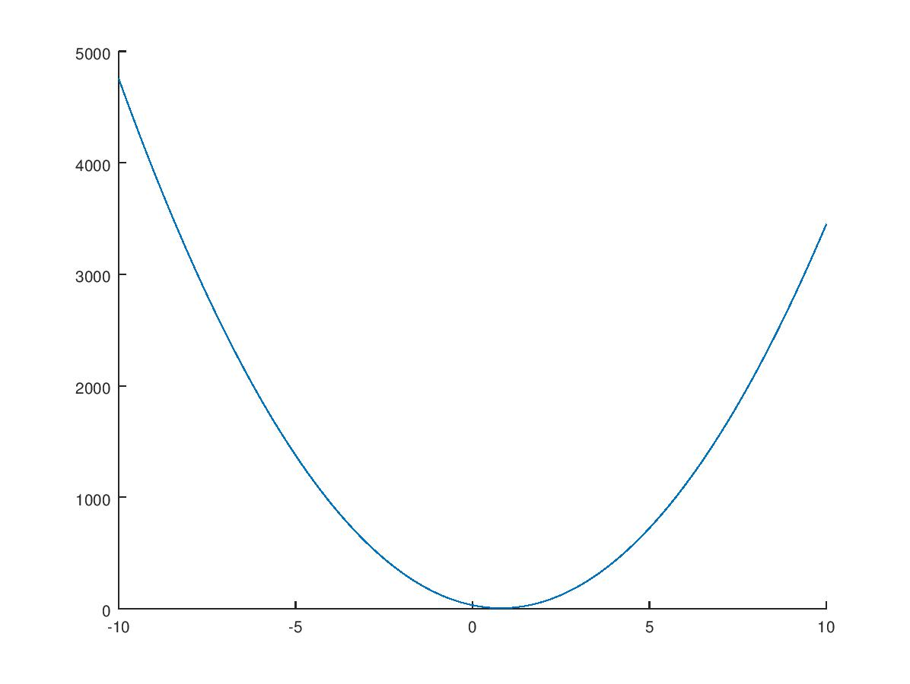
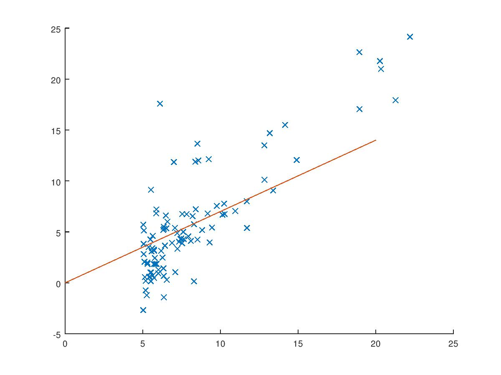
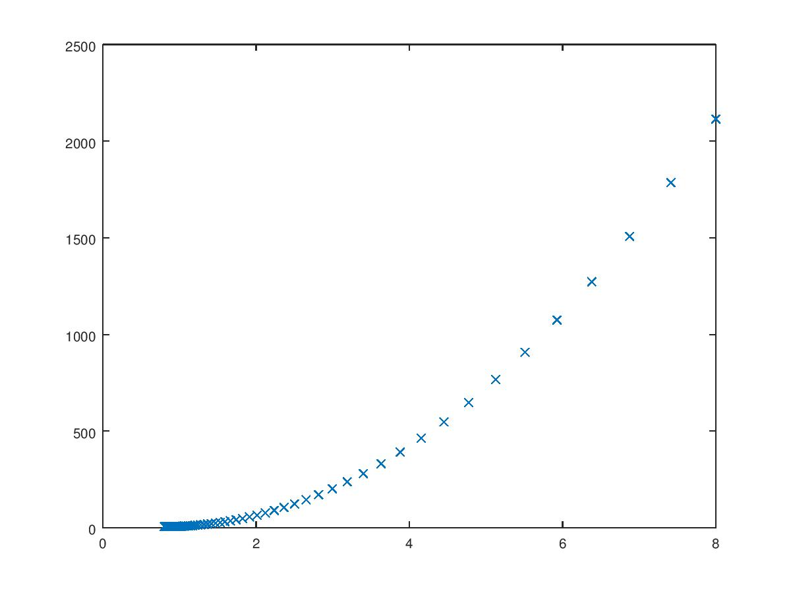

# Linear Regression

## Goal: Find the relationship between the x and y values.

## Cost Function
The purpose of the cost function is to measure the accuracy of various hypotheses. To start, we'll try out a range of values for the slope and skip the y-intercept for now, calling this range &theta;1. For every slope, we can sum the errors - or the distance between that line and each coordinate - and by comparing the sums derived from a wide variety of &theta;, we can then find the best fit.

Here's the equation:

## Cost Function - Slope only
Using `./cost-function--slope-only.m`, I created a vector &theta;1 using a range of -10 to 10 at increments of 0.1. For each one of these values, I calculated the mean squared error and loaded up the result vector, J. Now, we can plot the relationship between &theta;1 and J.

The values at the bottom of the parabola are better fits than values higher up, because those results reflect lower sums when calculating the mean squared error. Just eyeballing it, we can see that when &theta;1 is around 0.7, the sum of the errors from that line to all of the coordinates is the least.

Now, we could dig around in the result vector to find the lowest value, or we could make a machine do it.

## Gradient Descent
The goal of gradient descent is to find the minimum. In the case of plotting &theta;1 vs J, just like our eye chooses a point on the graph and then follows it down until it finds the bottom, so gradient descent starts with a coordinate as its guess and then proceeds to update &theta;1 as J gets lower and lower.

There are a few ways that this could conceivably be done. One way would be to take a guess at &theta;1, find its corresponding J, then subtract some constant value from &theta;1, calculate the new J and compare it to the previous J. If the new J is less than the old J, proceed. Once the new J is greater, you'd stop because you may have found a minimum.

Gradient descent is a bit more elegant in that it uses the derivative of J. When a local minimum is found, the derivative will equal 0 and prevent you from continuing. However, in my limited experience, I've found that adding a check to see if the derivative has reached a very small value can be helpful, in addition to limiting the iterations.

Here's the equation for updating &theta;1.

The meat of this is equation is the derivative of the cost function, which is shown below. Once that part is understood, you're on your way.

The slope gradually decreases it approaches zero and ensures we won't overshoot the minimum. The &alpha; is there to reduce the value of the derivative so that we don't instantly overshoot the minimum. Using `./gradient-descent--slope-only.m`, we can visualize the result:

The program outputs to the terminal that the minimum for &theta;1 is 0.802539, so not far off from our previous prediction.