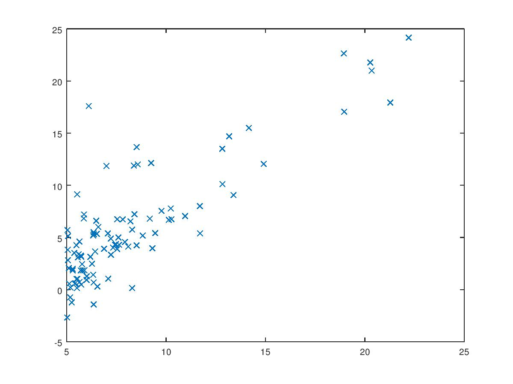
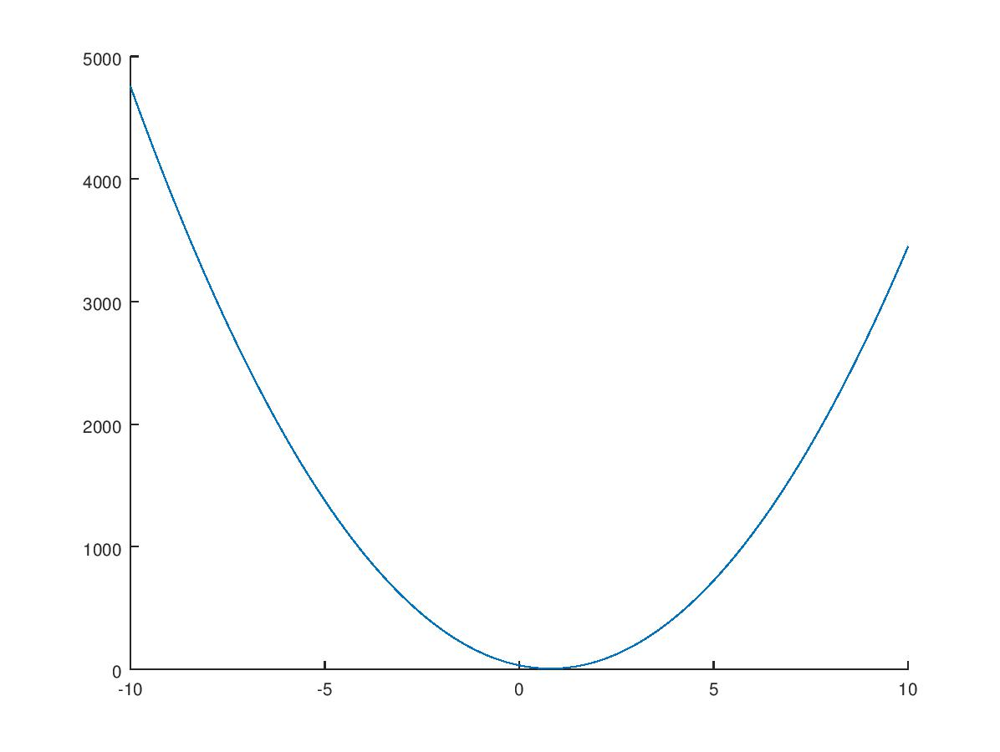
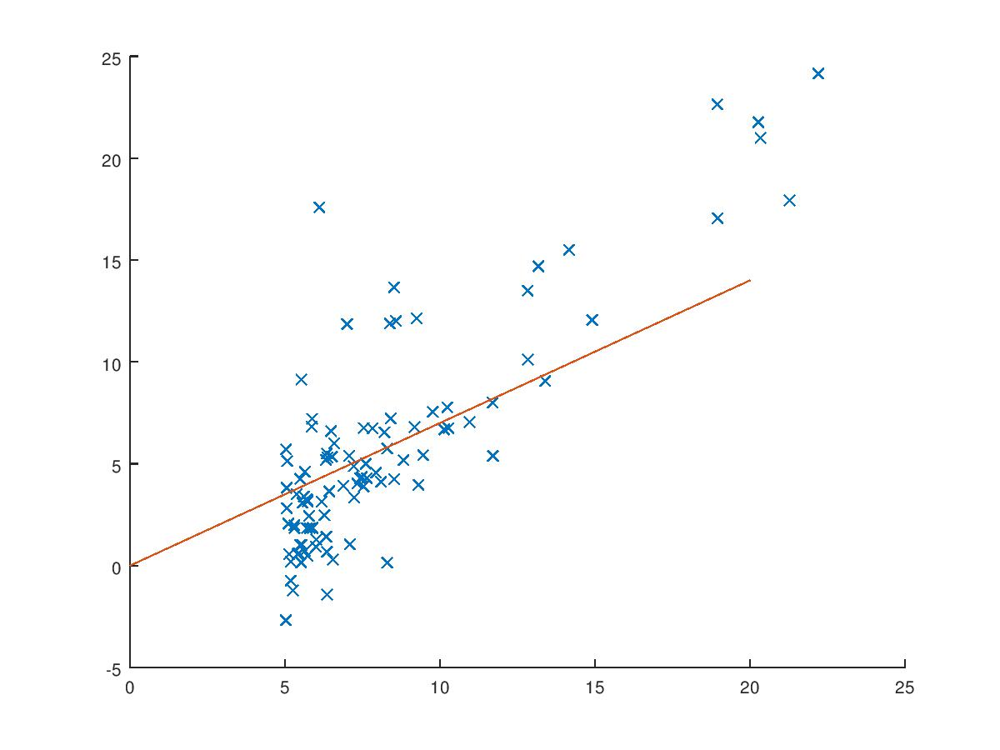

# Linear Regression

## Goal: Find the relationship between the x and y values.

## Cost Function
The purpose of the cost function is to measure the accuracy of various hypotheses. To start, we'll try out a range of values for the slope and skip the y-intercept for now, calling this range &theta;1. For every slope, we can sum the errors - or the distance between that line and each coordinate - and by comparing the sums derived from a wide variety of &theta;, we can then find the best fit.

## Cost Function - Slope only
Using `./cost-function--slope-only.m`, I created a vector &theta;1 using a range of -10 to 10 at increments of 0.1. For each one of these values, I calculated the mean squared error and loaded up the result vector, J. Now, we can plot the relationship between &theta;1 and J.

The values at the bottom of the parabola are better fits than values higher up, because those results reflect lower sums when calculating the mean squared error. Just eyeballing it, we can see that when &theta;1 is around 0.7, the sum of the errors from that line to all of the coordinates is the least.

Now, we could dig around in the result vector to find the lowest value, or we could make a machine do it.

## Gradient Descent